# 🧠 线稿生成项目 — 全量算法思维导图

```mermaid
mindmap
  root((🎨 线稿生成<br/>项目算法全景))
    后端_图像处理_Python
      data.py_图像数据流
        read_img_path
          路径/PIL_兼容读取
          强制_RGB_转换
          记录原始尺寸
        get_transform_预处理管线
          BICUBIC_Resize_512x512
          ToTensor_0.0~1.0
          Normalize_[-1.0~1.0]
        tensor_to_img_张量逆向
          去批次_BCHW→CHW
          逆归一化_+1/2×255
          uint8_转换
          单通道广播_→_3通道
          CHW→HWC_轴转置
        save_image_回弹保存
          BICUBIC_反向插值
          恢复原始分辨率
      test.py_线稿提取
        equalize_clahe
          RGB→BGR→LAB
          CLAHE_局部均衡
          8x8网格_对比度限制
          LAB→BGR→RGB
        _xdog_line_drawing
          双尺度_GaussianBlur
          DoG_差分高斯
          Tanh_软阈值映射
          OTSU_自适应二值化
        _skeletonize_骨架提取
          距离变换_DIST_L2
          脊线_局部最大值
          交叉核_3x3膨胀
        _remove_spurs_去毛刺
          3x3邻域卷积分
          检测端点_hits==11
          迭代腐蚀_默认3步
        _dilate_from_skeleton
          椭圆结构膨胀核
          GaussianBlur_边缘柔化
          阈值二值化
        _anime_line_pipeline
          XDoG_提取 → 骨架化 → 去毛刺 → 均匀膨胀 → 柔化边缘
          宽度倍率控制
        sketch2anime_完整管线
          CLAHE_增强_可选
          灰度转换
          动漫线稿管线
          BICUBIC_回弹
          纯黑纯白二值化
          NEAREST_压缩_可选
      model.py_深度学习
        基础构建块
          EncoderBlock
            Conv2d_s=2
            BatchNorm
            LeakyReLU_0.2
          DecoderBlock
            Bilinear_↑2
            cat_Skip_Connection
            Conv2d_3x3
            BatchNorm_Dropout
            ReLU
        平滑上采样组件
          GaussianSmoothing
            固定3x3高斯核_/16
            分组卷积_groups=C
            ReflectionPad_边缘
          MLPResidualBlock
            Conv_1x1
            GELU_激活
            Conv_1x1
            残差连接_add
          SmoothUpsampleBlock
            bilinear_↑2
            高斯平滑
            MLP_残差微调
            cat_跳跃连接
            Conv_3x3_BN_ReLU
        UnetGenerator_default模式
          8层编码器_3→64→512
          对称8层解码器_跳跃连接
          Tanh_输出_1通道
        ImprovedUpsampleSmooth_improved
          相同编码器
          SmoothUpsampleBlock_解码器
          消除棋盘伪影
        create_model_路由
          default_→_UnetGenerator
          improved_→_ImprovedUpsampleSmooth
        权重初始化
          正态分布_mean=0_std=0.02
    后端_API_Flask
      server.py
        CORS_跨域
          Access-Control_Allow_Origin:_*
          方法/头/缓存_控制
        图片上传接口
          sketch2anime_返回_PNG
          sketch2anime_b64_Base64
          sketch2anime_upload_微信专用
        参数解析
          mode_模式选择
          use_clahe_CLAHE开关
          clahe_clip_对比度系数
          output_size_输出尺寸
          thickness_scale_线宽倍率
        社区API
          community_get_分页查询
          community_add_匿名发布
          community_upload_image_图片上传
          community_like_点赞递增
          本地JSON存储_绝对匿名
    前端_微信小程序
      蓝牙打印_ble-printer.js
        BLE_连接流程
          适配器打开_重试3次
          设备发现_allowDuplicates
          自动连接_模糊匹配名称
          服务/特征值_模糊UUID匹配
          启用NOTIFY_接收数据
        BLE_协议发送
          gridToImageData_点阵压缩
            每8像素压缩1字节
            高位在前_MSB_first
          sendImageData_主协议
            START_0x01
            DATA×8_0x02_串行递归
            END_0x03_累加和校验
            等待_READY_超时机制
            PRINT_0x04
          sendPrintData_兼容协议
            INIT→逐行ROW→END
        debugPrintPackets_脱机调试
          控制台打印协议包
      手绘马赛克_index.js
        _renderBlankMosaicGrid
          动态格子大小≤640px
          全白网格初始化
          绘制网格线
        _getCellFromTouch
          clientX→列_坐标映射
          clientY→行
          boundingRect_归一化
        _paintCell_翻转
          0↔1黑白翻转
          增量Canvas导出
        _initMosaic_照片初始化
          drawImage_缩放
          getImageData_采样
          中心点灰度_阈值128
        confirmEdit_参数验证
          parseFloat→clamp
          round_按精度舍入
      ink-splash_泼墨填充
        _floodFill_泛洪填充
          BFS_四方向搜索
          闭合检测_触边拒绝
          颜色容差_35
          线稿阈值_100
          快照栈_最多30步撤回
        _showPreviewAt_预览
          BFS_搜索同色区域
          浅灰覆盖_preview
          坐标映射_CSS→像素
        onUndo_撤回
          stack_pop_恢复快照
      image-cropper-handles_裁剪
        触摸事件处理
          8方向控制点_resize
          中心拖拽_pan
          正方形裁剪_1:1
        _clampCrop_边界约束
          不超图片边界
          最小尺寸50x50
        onConfirm_裁剪输出
          img.width/iw_缩放比
          destWidth/destHeight
      image-cropper_裁剪_旧版
        双指缩放_pinch
          距离比计算
          边界约束
        半透明遮罩绘制
          四边遮罩_圆角高光
      community.js_社区
        fetchPhotos_分页加载
          触底加载更多
          下拉刷新
        _splitIntoColumns_瀑布流
          最短列优先分配
          累计高度估算
        handleLike_点赞
          本地缓存防重复
          UI_即时更新
```

---

## 📊 算法分类统计

| 分类 | 数量 | 核心算法 |
|------|------|----------|
| 🖼️ 图像预处理 | 6 | CLAHE、BICUBIC Resize、ToTensor、Normalize |
| 🧠 深度学习网络 | 7 | U-Net、ImprovedUpsampleSmooth、GaussianSmoothing、MLPResidual |
| ✏️ 线稿提取 | 5 | XDoG、骨架化(距离变换)、去毛刺、均匀膨胀、动漫管线 |
| 📱 前端交互 | 8 | BFS泛洪填充、触摸坐标映射、裁剪拖拽、双指缩放、瀑布流 |
| 🔵 BLE蓝牙 | 5 | 连接重试、设备发现、协议化发送、校验和、超时等待 |
| 🛠️ 工具辅助 | 4 | 张量逆向、参数验证、点阵压缩、栈式撤回 |

> 🎯 **核心创新点**: XDoG + 骨架化(1px均匀线宽) + 平滑上采样U-Net(消除棋盘伪影)
